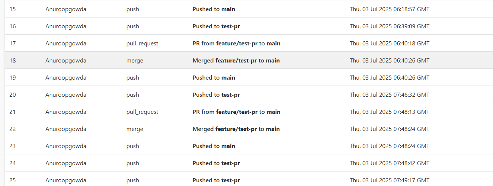

# Webhook Repo

A Flask-based webhook receiver for GitHub events. It captures push, pull request, and merge events from `action-repo`, stores them in MongoDB Atlas, and displays them live on a frontend page.

---

## Tech Stack

- **Flask** (Python) — Webhook endpoint and API
- **MongoDB Atlas** — Cloud database for event storage
- **HTML, JavaScript** — Frontend UI
- **Ngrok** — Expose local server publicly for GitHub webhook

---

## Features

- Receive and log GitHub push, PR, and merge events
- Store events securely in MongoDB
- Live frontend updates every 15 seconds
- Clean and responsive UI with serial numbering

---

## Screenshot

---

## How to Run

1. Clone this `webhook-repo`.
2. Install requirements: `pip install -r requirements.txt`.
3. Update `app.py` with their own MongoDB URI.
4. Install ngrok if not already installed: download from https://ngrok.com/download or `brew install ngrok` on Mac.
5. Run Flask app: `python app.py`.
6. Start ngrok: `ngrok http 5000` and copy the new URL.
7. Fork the `action-repo` to their GitHub account.
8. In their forked repo, add a new webhook using their ngrok URL with `/webhook` path and set content type to `application/json`.
9. Commit and push to see events displayed on their UI!

## Introduction and project demo
my introduction:  https://drive.google.com/file/d/1ic97tbgzP-WOxtLRnmIWVe49ZBbUFWZ0/view?usp=sharing  
project demo:     https://drive.google.com/file/d/1Xqx-0iqyuTn3BgFwj_7p1nDeYWGCmw9U/view?usp=sharing
    
